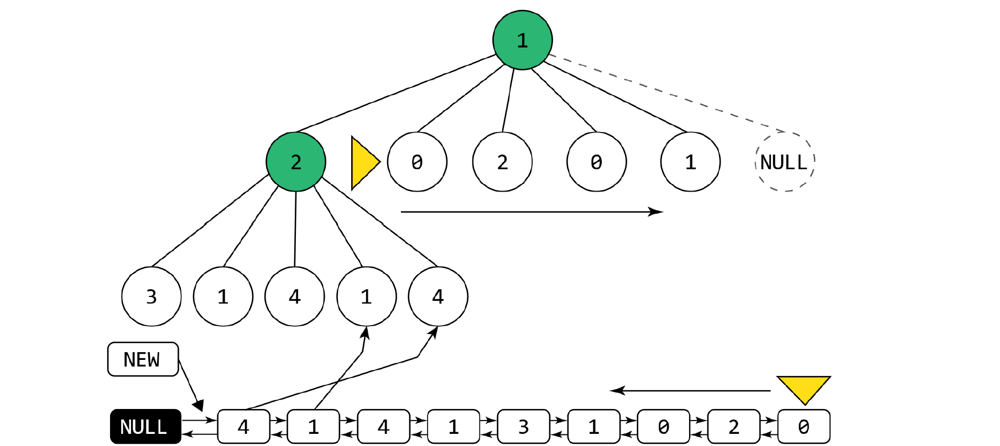
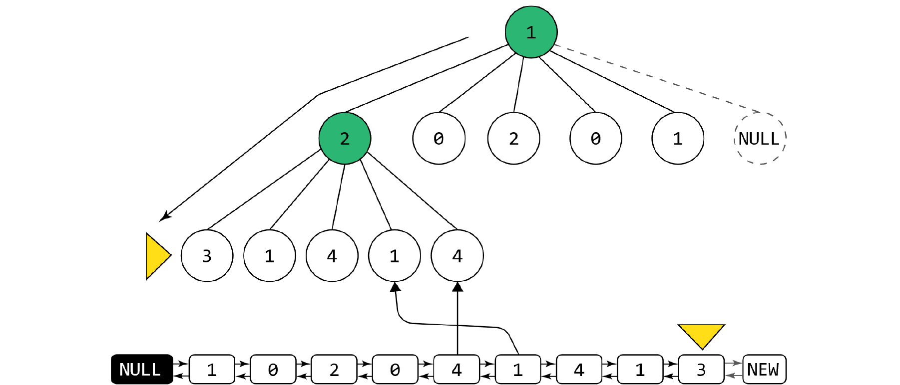
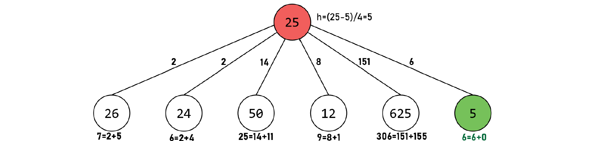
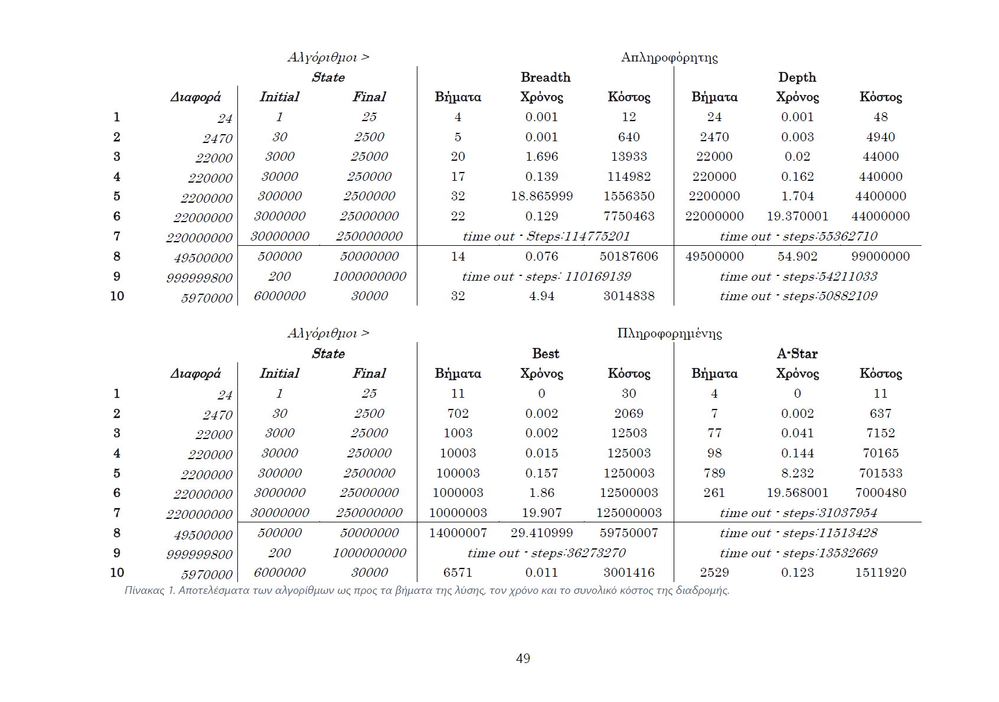
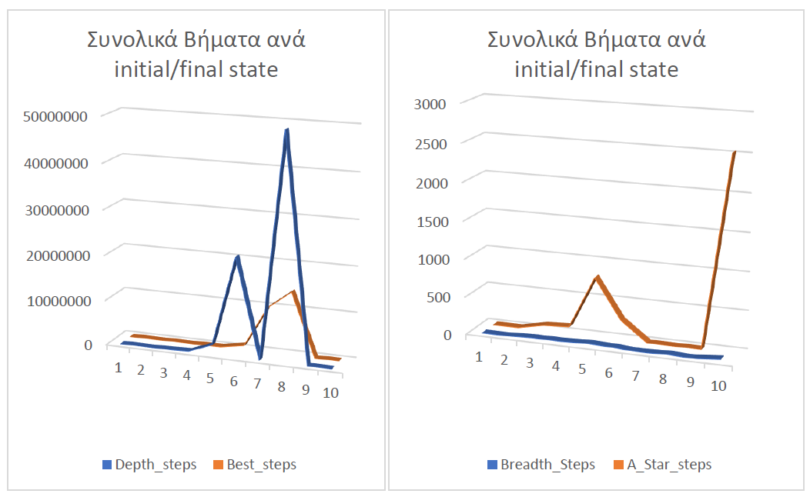
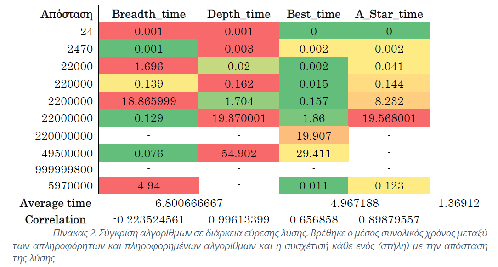

# Register_AI_Search


 _Breadth-first search, Depth-first search, Best-first search, A-Star search algorithms and AVL Trees implemented in C_

For explanation of the entire code and results see the  [paper (59 pages)  ](https://drive.google.com/file/d/1QkLSCXCTiIJq6H3SxUDSYmt1hnOC6S2y/view?usp=sharing) .

## Integer Register Processor


This project is about a processor with a single register that stores non-negative integer values. Only a specific set of operations can be applied to this register, which are the following:

* Increment by one
* Decrement by one
* Double
* Halve
* Square
* Square root

The goal of the program is to accept two values, the starting and the final state, and return the steps that need to be executed to reach this final state.

Algorithms that solve this problem are search algorithms in Artificial Intelligence, uninformed and informed search algorithms. Specifically, the Breadth-first search, Depth-first search, Best-first search and A-Star search algorithms were implemented in C language.

To run the program, you need to select 4 things along with the command line, the search algorithm, the initial state, the final state and finally the name of the file where the possible solution will be written (if found due to the time limit of 60 seconds). A clearer way to execute it is shown below:

```
REGISTERS.EXE <alg> <initial state> <final state> <file name.txt>
```

Where < alg > can take the values breadth, depth, best and star.

For example:

```
REGISTERS.EXE depth 30000 250000 dp.txt
```

## Search Tree

The algorithms mentioned above are 'built' on a tree called a search tree. The search tree is a structure that contains a set of the state space. Each node of the search tree is a state in the state space and each edge corresponds to an action. Each state can be connected to another, this connection is represented in the tree with the parent and the child table.

The limits of the state set are from 0 to 10^9.

## Search Frontier

Each algorithm needs a structure that allows the storage and retrieval of elements and states from the search tree. This structure is called the search frontier and is used by the algorithms to access states. Each algorithm has different needs, for this reason, the most suitable structure was chosen with the main criterion being speed. In uninformed search algorithms, a linked list satisfies these needs as it allows the insertion and deletion of specific positions in the list. The main need here is a structure that can be used as a queue and stack. All that is needed are two pointers that point to the beginning and end of the list. But what if a value needs to be found based on criteria? A list like this does not cover this issue comfortably as it requires a thorough search from start to finish, something that as the algorithm progresses, the list grows with a consequent delay to a great extent. For informed search algorithms, the balanced tree structure was used so that the element could be found as quickly as possible. Specifically, an AVL balanced tree structure was implemented.

## AVL TREE

AVL trees are a special case of height-balanced trees p = 1. For a binary tree to be called height-balanced p, the difference between the heights of its two subtrees must be at most p for each node of the tree. Then, both the left and right subtrees are called p-trees. That is, for AVL trees, the difference between the height of the left and right nodes must be at most or equal to one (1). A notable advantage of these trees is that insertion, searching and deletion from a balanced AVL tree with n nodes can be done in the worst case in time proportional to 𝑂(log2 𝑛). This means that its behavior is approximately that of a perfectly balanced binary search tree (Μισυρλής, 2022, pp. 271–273).

Each node of the AVL tree also carries a balance factor. When a subtree of the node contains more nodes than the other, the notional balance of the tree 'tilts', i.e. the subtree has more weight than the other, causing similar behavior to a simple binary search tree.

## Breadth First Search



The breadth-first algorithm first examines the states that are at the same depth of the tree and only when it has examined all of them, it continues to examine the states that are at the next depth of the tree. One could say that the search resembles waves that start from the first left level of the tree to the right and then continue to the next lower depth (ΒΛΑΧΑΒΑΣ et al., 2020).

The search frontier is a linked list that starts from the first NULL node and adds new nodes after it. This list will be used as a FIFO (First In First Out) queue structure, as the main key of the algorithm is to place new states at the back and extract elements from the front. Thus, no new state will be expanded unless those that are at a smaller depth are expanded first.


## Depth First Search



As its name suggests, the Depth First Search algorithm chooses to expand the state that is deepest in the tree and specifically chooses the leftmost one first.

The search frontier in the Depth First Search algorithm is used as a stack. This means that the last state entered into the frontier is the first to be extracted. This creates the behavior in the algorithm, as it expands the nodes and adds them to the frontier, the next one that will be extracted for expansion will always be the leftmost one at the next depth.


## Greedy Best First Search


The heuristic mechanism is a strategy based on the knowledge of the problem in order to solve it quickly. For the Best First Search algorithm, the heuristic function is used to calculate the remaining distance from the current node, i.e. ℎ = |𝑐𝑢𝑟𝑟𝑒𝑛𝑡𝑆𝑡𝑎𝑡𝑒 → 𝐷𝑎𝑡𝑎 − 𝑓𝑖𝑛𝑎𝑙_𝑆𝑡𝑎𝑡𝑒| and the lowest value is selected. This assumes that it is closer to the goal as it is an estimate of the actual distance without including any possible obstacles.


## A * (Star)



The A* search algorithm is optimal, which means that it will always find the solution with the lowest cost. This algorithm belongs to the same category as Best First Search. The difference is that the cost that has been traveled from the beginning to the current state is added to the heuristic value, i.e.: 𝑓(𝑆) = 𝑔(𝑆) + ℎ(𝑆) where 𝑔(𝑆) is the distance from the beginning to the current state and ℎ(𝑆) is a heuristic function as in the Best First Search algorithm. 
In order for the algorithm to be optimal in terms of cost, it must be admissible, i.e. it must never overestimate the cost. In this case, using the same heuristic function from the Best First Search algorithm, the cost is overestimated. Suppose that the initial state is 25 and the final state is 5. If this heuristic function were used, it would calculate the estimate ℎ = 25 − 5 = 20 while the actual cost to reach 5 is 6, by performing only one action of this square root √25 = 5 ∶ 𝑐𝑜𝑠𝑡 = 6. This does not guarantee that it will find the optimal solution. A solution to this problem is to divide the heuristic function ℎ by 4. In this way the estimate is smaller than the real cost

## Comparative Analysis of Algorithms



The following is a comparison of the algorithms presented. For the comparison, initial and final states were selected, where the initial states are initially increased in a similar and steady manner. This is done to more easily show any differences between them. The algorithms were run on Windows 11 Home version 23H2 software. During the execution, no other application was running in order to have as much available memory and computing power as possible. The processor is an 11th generation Intel-i5 with a speed of 2.40GHz and available RAM of 15.8GB. The application is built on a x64 bit architecture.


### Comparing the Total Steps of Solutions



Comparing the total number of steps required to solve the problem, we conclude that the Breadth First Search algorithm is the most efficient, with the smallest number of steps compared to all others.

This is expected, as for each level of the search tree, the algorithm searches for the solution across its entire width. Therefore, any solution found will be the shortest possible in terms of the number of steps. We can say that Breadth First Search is optimal regarding the solution steps.

Next comes the A* algorithm, which in the first test found the same distance as Breadth First Search, but then its steps increased. A* does not find solutions based on steps (number of actions) but according to the cost. There may be a short path to the final state, but if it is too costly, it tries to find a cheaper path by avoiding it.

The worst algorithms regarding the total solution steps are the Greedy Best First Search and then Depth First Search.

Interestingly, the number of steps in the Depth First Search solution equals the difference between the initial and final states. This is explained by the way the search tree is structured. The path it follows is that of increasing by one, as this is the leftmost action.

In the case where the final state is behind the initial state, the algorithm will access all states until it reaches a dead end. Then, it continues to the next right node, but since we keep the accessed states, it will continue to expand states that are before the initial state.


### Time Complexity Analysis



In terms of the time required to find a solution, the algorithms do not differ when the solution is close to the initial state (tests 1 and 2).

Generally, the time to find a solution increases as the distance between the initial and final states increases. This is not necessarily the case with the Breadth First Search algorithm. Although the distance between the two states increases, it does not necessarily mean that it becomes slower. This indicates a non-strong (but not weak) correlation between the solution distance and the solution time, as also shown by the correlation value of -0.223, which is close to 0 (CORREL function - Microsoft Support).

This can be explained by the number of actions that can be applied to a state. Some actions that could "bypass" time are squaring and square root because they create a large "jump" of states.

In conclusion, the mean value was calculated for uninformed and informed search algorithms. As it turns out, informed algorithms are on average 1.37 times faster than uninformed algorithms. It should be noted that the results from the above are limited to the sample size.

### Cost Analysis


There is no doubt that the cost of the solution is always the cheapest in A*.

The Depth First Search algorithm is the worst of all, due to its "blind" search method, it finds solutions with many steps. This of course also causes the high cost.


## Visual Studio 2022

Microsoft Visual Studio Community 2022 version 17.9.0 Preview 1.0 was used to write the code. Although the code was written in C, the Visual C++ 2022 compiler was used, i.e. the library scope is that of C++ and not C. This is explained because it may not be compatible with other compiler versions.


# GNU GENERAL PUBLIC LICENSE

__Copyright (C) 2024 Bill Chamalidis__

This program is free software: you can redistribute it and/or modify

it under the terms of the GNU General Public License as published by

the Free Software Foundation, either version 3 of the License, or

(at your option) any later version.

This program is distributed in the hope that it will be useful,

but WITHOUT ANY WARRANTY; without even the implied warranty of

MERCHANTABILITY or FITNESS FOR A PARTICULAR PURPOSE.  See the

GNU General Public License for more details.

You should have received a copy of the GNU General Public License

along with this program.  If not, see <https://www.gnu.org/licenses/>.
